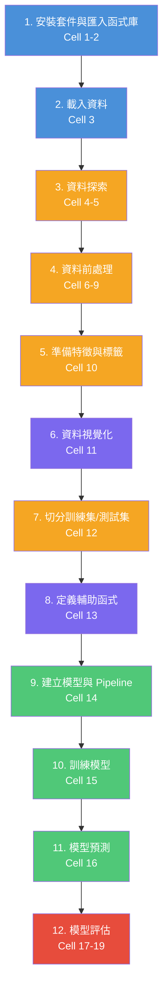
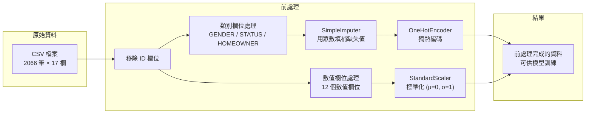
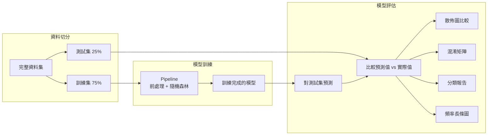
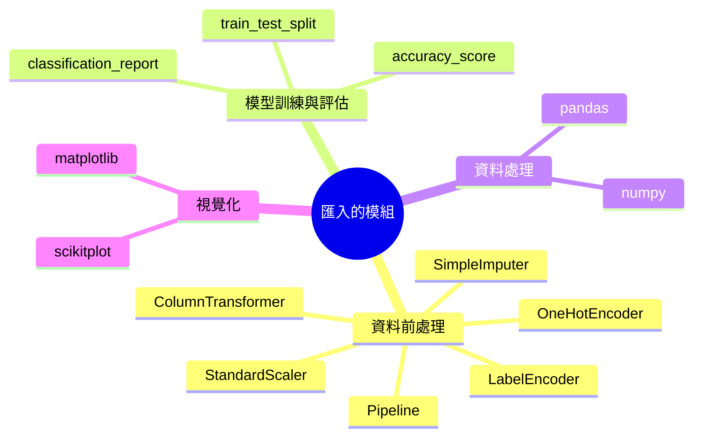
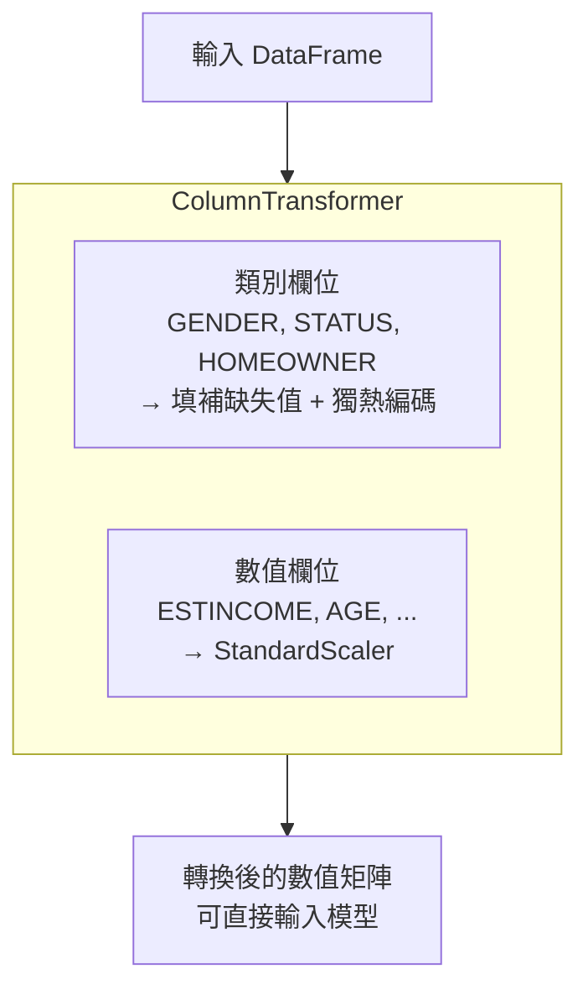
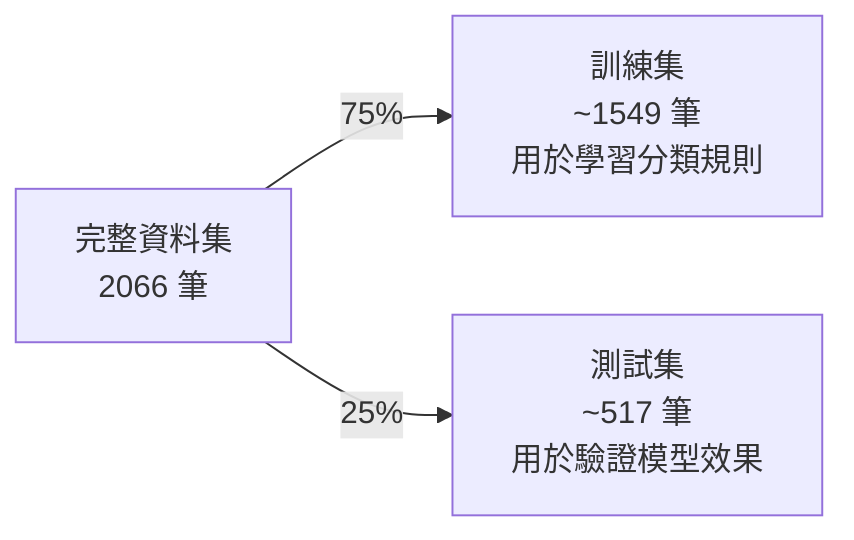
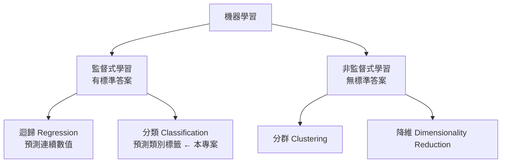
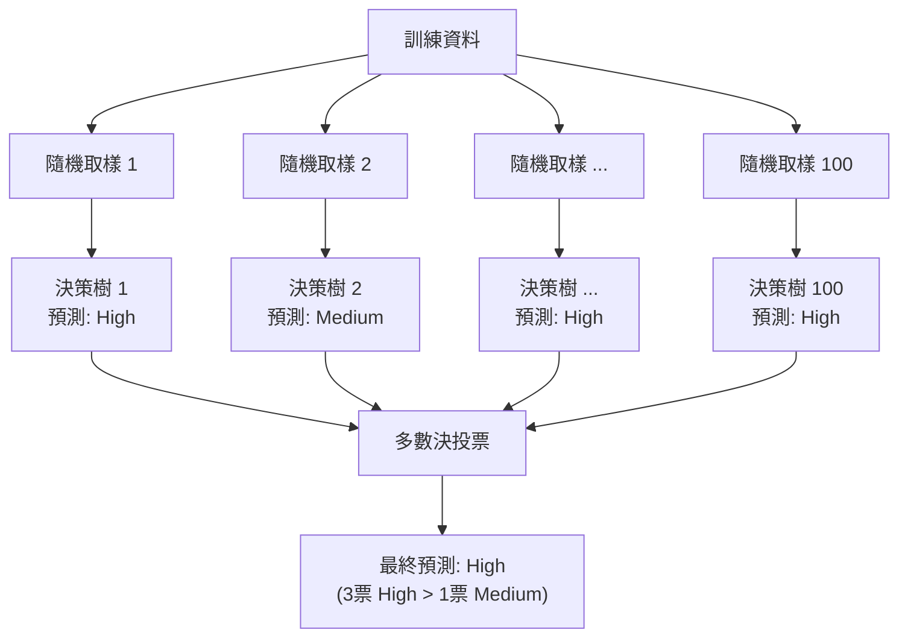

# IBM 客戶流失風險預測 — 完整教學手冊

> 本手冊對應 Notebook 檔案：`IBM_first_ML_model.ipynb`
>
> 原始資料來源：[IBM ML Learning Path Assets](https://github.com/IBM/ml-learning-path-assets)

---

## 一、專案概述

### 1.1 專案目標

本專案的核心任務是：**根據客戶在線上交易平台的行為資料，預測其流失風險等級（Churn Risk）**。

在金融交易平台的營運中，留住客戶是維持獲利的關鍵。若能提前辨識出高流失風險的客戶，企業就能主動採取行動（例如提供優惠、改善服務），降低客戶流失率。

### 1.2 預測目標

模型會將每位客戶分類為以下三種流失風險等級之一：

| 等級 | 說明 | 建議行動 |
|------|------|----------|
| **High（高風險）** | 客戶很可能即將離開平台 | 立即介入，提供個人化優惠 |
| **Medium（中風險）** | 客戶有一定的流失可能性 | 持續關注，適時推播活動 |
| **Low（低風險）** | 客戶穩定使用平台 | 維持現有服務品質 |

### 1.3 使用的演算法

本專案採用 **Random Forest（隨機森林）** 分類演算法。隨機森林是一種**整合學習（Ensemble Learning）** 方法，透過建立多棵決策樹並以多數決投票來決定最終分類結果。

**為什麼選擇隨機森林？**

- 不容易過擬合（Overfitting），泛化能力強
- 對缺失值與離群值有一定的容忍力
- 不需要太多參數調整就能有不錯的效果
- 可以處理類別型與數值型混合的資料

### 1.4 使用的技術與套件

| 套件 | 用途 |
|------|------|
| `pandas` | 資料讀取、清洗、操作 |
| `numpy` | 數值運算與陣列操作 |
| `scikit-learn` | 機器學習模型訓練與評估 |
| `matplotlib` | 繪製統計圖表 |
| `scikit-plot` | 快速繪製混淆矩陣等 ML 評估圖 |

---

## 二、專案完整流程

### 2.1 流程圖



### 2.2 資料前處理流程（詳細）



### 2.3 模型訓練與評估流程



---

## 三、資料集說明

### 3.1 資料來源

資料集來自 IBM 的機器學習教學資源，包含 **2066 位客戶** 的交易平台行為資料。

### 3.2 欄位說明

| 欄位名稱 | 資料型態 | 說明 | 類型 |
|----------|---------|------|------|
| `ID` | int | 客戶唯一識別碼（建模前移除） | — |
| `CHURNRISK` | str | **目標變數**：流失風險等級（High/Medium/Low） | 標籤 |
| `GENDER` | str | 性別（M/F），有 3 筆缺失值 | 類別特徵 |
| `STATUS` | str | 婚姻狀態（M=已婚/S=單身） | 類別特徵 |
| `HOMEOWNER` | str | 是否為屋主（Y/N） | 類別特徵 |
| `CHILDREN` | int | 子女數量 | 數值特徵 |
| `ESTINCOME` | float | 預估年收入 | 數值特徵 |
| `AGE` | int | 年齡 | 數值特徵 |
| `TOTALDOLLARVALUETRADED` | float | 交易總金額 | 數值特徵 |
| `TOTALUNITSTRADED` | int | 交易總單位數 | 數值特徵 |
| `LARGESTSINGLETRANSACTION` | float | 最大單筆交易金額 | 數值特徵 |
| `SMALLESTSINGLETRANSACTION` | float | 最小單筆交易金額 | 數值特徵 |
| `PERCENTCHANGECALCULATION` | float | 變動百分比 | 數值特徵 |
| `DAYSSINCELASTLOGIN` | int | 距上次登入天數 | 數值特徵 |
| `DAYSSINCELASTTRADE` | int | 距上次交易天數 | 數值特徵 |
| `NETREALIZEDGAINS_YTD` | float | 今年已實現淨收益 | 數值特徵 |
| `NETREALIZEDLOSSES_YTD` | float | 今年已實現淨損失 | 數值特徵 |

### 3.3 資料品質問題

- **缺失值**：`GENDER` 欄位有 3 筆缺失（2066 筆中只有 2063 筆有值）
- **處理方式**：使用 `SimpleImputer(strategy="most_frequent")` 以眾數填補

---

## 四、各 Cell 詳細說明

### Cell 1：安裝套件

**目的**：安裝本專案所需的所有 Python 套件。

> **注意**：若使用 `uv` 管理虛擬環境，可改用 `uv pip install` 安裝，且需注意套件版本相容性。例如 `scikit-plot 0.3.7` 與新版 `scipy` 不相容，需改用 `scikit-plots`。

### Cell 2：匯入函式庫

**目的**：匯入所有需要的模組。

匯入的模組可分為四大類：



### Cell 3：載入資料

**目的**：從 GitHub 讀取 IBM 開放資料集。

**重點**：
- 使用 `pd.read_csv()` 直接從 URL 讀取 CSV
- `df.head()` 顯示前 5 筆，快速確認資料結構
- 此資料集的 `GENDER` 欄位刻意包含缺失值，用於練習缺失值處理

**資料範例**：

| ID | CHURNRISK | GENDER | STATUS | CHILDREN | ESTINCOME | HOMEOWNER | AGE |
|----|-----------|--------|--------|----------|-----------|-----------|-----|
| 1703 | Medium | NaN | M | 2 | 28766.9 | N | 47 |
| 1704 | Low | NaN | M | 2 | 91272.2 | Y | 25 |
| 1706 | High | M | M | 1 | 64792.3 | N | 52 |

### Cell 4：資料探索 — 欄位型態與缺失值

**目的**：了解資料的基本結構，決定後續前處理策略。

**觀察重點**：
- **資料型態**：`object`（文字）= 類別型，需要編碼；`int64` / `float64` = 數值型，需要標準化
- **缺失值偵測**：`GENDER` 只有 2063 筆（總共 2066 筆），代表有 3 筆缺失

### Cell 5：資料探索 — 目標變數分布

**目的**：檢視 `CHURNRISK` 的類別分布是否平衡。

**為什麼這很重要？**

若類別嚴重不平衡（例如 99% 是 Low），模型只要「全部猜 Low」就能達到 99% 準確率，但這樣的模型毫無用處。了解分布後才能判斷是否需要做資料平衡處理（如 SMOTE、欠取樣等）。

### Cell 6：資料前處理 — 移除 ID 欄位

**目的**：移除不具預測意義的 `ID` 欄位。

**為什麼要移除？**

`ID` 只是流水號，不包含任何客戶行為資訊。若保留，模型可能學到「ID=1703 → Medium」這種無意義的規則，反而降低對新資料的預測能力。

### Cell 7：資料前處理 — 類別型特徵處理

**目的**：將文字類別轉換為模型可處理的數值格式。

**處理流程**：


**獨熱編碼範例**：

| 原始 GENDER | GENDER_F | GENDER_M |
|------------|----------|----------|
| M | 0 | 1 |
| F | 1 | 0 |
| NaN → M | 0 | 1 |

### Cell 8：資料前處理 — 數值型特徵處理

**目的**：將不同量級的數值特徵標準化。

**為什麼需要標準化？**

| 特徵 | 原始範圍（舉例） | 問題 |
|------|-----------------|------|
| ESTINCOME | 20,000 ~ 100,000 | 量級大，會主導模型 |
| DAYSSINCELASTTRADE | 1 ~ 30 | 量級小，容易被忽略 |

**StandardScaler 公式**：

$$z = \frac{x - \mu}{\sigma}$$

標準化後，所有特徵都在同一個量級（平均值=0，標準差=1），模型能公平地考量每個特徵。

### Cell 9：資料前處理 — 建立 ColumnTransformer

**目的**：將類別型與數值型的前處理整合為一個統一的轉換器。

**ColumnTransformer 的運作方式**：



### Cell 10：準備特徵與標籤

**目的**：將資料分為「輸入特徵 X」與「輸出標籤 y」。

| 概念 | 變數名稱 | 內容 | 說明 |
|------|---------|------|------|
| 特徵（X） | `features` | GENDER, STATUS, AGE, ESTINCOME, ... | 模型學習的依據 |
| 標籤（y） | `label` | CHURNRISK → 0, 1, 2 | 模型要預測的目標 |

**LabelEncoder 的對應關係**（按字母順序）：

| 原始標籤 | 編碼數字 |
|---------|---------|
| High | 0 |
| Low | 1 |
| Medium | 2 |

### Cell 11：資料視覺化 — 2D 與 3D 散佈圖

**目的**：在訓練前觀察資料分布，判斷不同風險等級的客戶是否在特徵空間中有明顯分群。

**選用的三個維度**：
- **X 軸**：`ESTINCOME`（預估收入）
- **Y 軸**：`DAYSSINCELASTTRADE`（距上次交易天數）
- **Z 軸**（3D）：`TOTALDOLLARVALUETRADED`（交易總金額）

**顏色對應**：
- 🟤 紅棕色 `#BB6B5A` = High（高風險）
- 🟡 黃色 `#E5E88B` = Medium（中風險）
- 🟢 綠色 `#8CCB9B` = Low（低風險）

**觀察重點**：若三種顏色的點完全混在一起，代表這三個特徵不足以區分風險等級；若有明顯分群，代表模型有機會學到有效規則。

### Cell 12：切分訓練集與測試集

**目的**：將資料分為訓練集（75%）與測試集（25%）。



**為什麼要切分？**

如果用全部資料訓練又用全部資料測試，模型只是「背答案」，無法驗證它對新資料的預測能力。這就像考試時用考古題練習，但測驗時也考同一份考古題 — 成績再高也不代表真的學會了。

### Cell 13：定義輔助函式

**目的**：定義四個用於模型評估的視覺化函式。

| 函式名稱 | 功能 | 使用時機 |
|---------|------|---------|
| `colormap()` | 將風險等級數字轉為顏色 | 繪圖時上色 |
| `two_d_compare()` | 2D 散佈圖：實際值 vs 預測值 | Cell 17 |
| `three_d_compare()` | 3D 散佈圖：實際值 vs 預測值 | 可選使用 |
| `model_metrics()` | 混淆矩陣 + 分類報告 | Cell 18 |

### Cell 14：建立 Random Forest 模型與 Pipeline

**目的**：建立完整的機器學習 Pipeline。

**隨機森林的參數設定**：

| 參數 | 值 | 說明 |
|------|-----|------|
| `n_estimators` | 100 | 建立 100 棵決策樹，透過投票提升穩定性 |
| `max_depth` | 2 | 每棵樹最多 2 層，限制複雜度避免過擬合 |
| `random_state` | 0 | 固定隨機種子，確保結果可重現 |

**Pipeline 結構**：


**Pipeline 的好處**：
- 訓練與預測時使用完全相同的前處理流程
- 避免「資料洩漏」（data leakage）：測試集不會影響前處理的參數

### Cell 15：訓練模型

**目的**：用訓練集資料擬合模型。

呼叫 `rfc_model.fit(X_train, y_train)` 後，Pipeline 會自動完成：
1. 填補缺失值
2. 類別欄位獨熱編碼
3. 數值欄位標準化
4. 隨機森林學習分類規則

### Cell 16：模型預測

**目的**：對測試集進行預測。

`rfc_model.predict(X_test)` 會自動對 `X_test` 做前處理（與訓練時相同），再產生預測結果。

### Cell 17：模型評估 — 視覺化比較

**目的**：用 2D 散佈圖並排比較「實際值」與「預測值」。

**如何判讀**：
- 左圖是實際的風險分布，右圖是模型預測的風險分布
- 兩張圖的顏色分布越接近，代表模型越準確
- 若某區域顏色明顯不同，代表模型在該區域判斷錯誤

### Cell 18：模型評估 — 混淆矩陣與分類報告

**目的**：以量化指標精確評估模型表現。

#### 混淆矩陣（Confusion Matrix）

混淆矩陣是一個表格，顯示每個類別的分類結果：

```
               預測
            High  Low  Medium
實   High    [✓]  [✗]   [✗]
際   Low     [✗]  [✓]   [✗]
    Medium   [✗]  [✗]   [✓]
```

- **對角線**（✓）：正確分類的數量，越大越好
- **非對角線**（✗）：錯誤分類的數量，越小越好

#### 分類報告中的關鍵指標

| 指標 | 英文 | 意義 | 白話解釋 |
|------|------|------|---------|
| 精確率 | Precision | 預測為 X 的資料中，有多少真的是 X | 「我說是 High 的，有幾個真的是 High」 |
| 召回率 | Recall | 實際為 X 的資料中，有多少被正確找出 | 「真正 High 的人，我找到了幾個」 |
| F1 分數 | F1-Score | Precision 與 Recall 的調和平均數 | 綜合評估指標 |

### Cell 19：模型評估 — 比較長條圖

**目的**：以長條圖比較各類別在實際資料與預測結果中的頻率。

**如何判讀**：
- 綠色長條 = 實際值的頻率
- 紫色長條 = 模型預測值的頻率
- 若兩色長條高度接近，代表模型沒有系統性偏差
- 若某類別的紫色長條明顯高於/低於綠色，代表模型傾向於高估/低估該類別

---

## 五、核心概念整理

### 5.1 監督式學習（Supervised Learning）

本專案使用的是**監督式學習**中的**分類（Classification）** 任務：



### 5.2 過擬合 vs 欠擬合

| 狀態 | 說明 | 訓練準確率 | 測試準確率 |
|------|------|-----------|-----------|
| **欠擬合（Underfitting）** | 模型太簡單，連訓練資料都學不好 | 低 | 低 |
| **適當擬合** | 模型學到正確的規則 | 高 | 高 |
| **過擬合（Overfitting）** | 模型背答案，只對訓練資料有效 | 很高 | 低 |

本專案透過 `max_depth=2` 限制決策樹深度，防止過擬合。

### 5.3 Pipeline 的重要性

```mermaid
flowchart TD
    subgraph 沒有 Pipeline（危險）
        direction LR
        A1["手動前處理訓練集"] --> A2["訓練模型"]
        A3["手動前處理測試集<br/>（可能用錯參數！）"] --> A4["預測"]
    end

    subgraph 有 Pipeline（安全）
        direction LR
        B1["Pipeline.fit()<br/>自動前處理 + 訓練"] --> B2["Pipeline.predict()<br/>自動用相同參數前處理 + 預測"]
    end
```

Pipeline 確保訓練與預測使用**完全相同**的前處理參數（例如 StandardScaler 的平均值和標準差），避免資料洩漏。

### 5.4 隨機森林工作原理



每棵樹只看部分資料與部分特徵，減少單一決策樹的偏差。最終結果由 100 棵樹投票決定，提升預測的穩定性。

---

## 六、重點提醒與常見問題

### 6.1 執行順序

Notebook 中的 Cell 必須**依序執行**。若跳過某個 Cell，後續 Cell 可能因為缺少變數或物件而報錯。

### 6.2 套件版本相容性

原始 Notebook 使用較舊的套件版本。在 Python 3.12+ 環境中：
- `np.float` 和 `np.int` 已被移除 → 改用 `float` 和 `int`
- `scikit-plot 0.3.7` 與新版 `scipy` 不相容 → 改用 `scikit-plots`

### 6.3 為什麼 `max_depth=2` 可能不夠？

`max_depth=2` 表示每棵決策樹最多只能做 2 次分裂判斷。這雖然能有效防止過擬合，但可能導致模型過於簡單（欠擬合）。在實際應用中，通常會透過交叉驗證（Cross-Validation）來找到最佳的 `max_depth` 值。

### 6.4 模型的侷限性

- 本專案僅使用 Random Forest 單一演算法，未進行模型比較
- 未做超參數調整（Hyperparameter Tuning）
- 未處理類別不平衡問題（若存在）
- 特徵工程（Feature Engineering）的空間仍然很大

---

## 七、術語對照表

| 英文 | 繁體中文 | 說明 |
|------|---------|------|
| Churn | 流失 | 客戶停止使用服務 |
| Classification | 分類 | 將資料分到預定義的類別 |
| Feature | 特徵 | 模型的輸入變數 |
| Label | 標籤 | 模型要預測的目標變數 |
| Training Set | 訓練集 | 用於訓練模型的資料 |
| Test Set | 測試集 | 用於驗證模型效果的資料 |
| Overfitting | 過擬合 | 模型在訓練資料上表現好但在新資料上表現差 |
| Pipeline | 流水線 | 將多個處理步驟串接成一條自動化流程 |
| One-Hot Encoding | 獨熱編碼 | 將類別值轉為二元向量 |
| StandardScaler | 標準化 | 將數值轉換為平均值=0、標準差=1 |
| Confusion Matrix | 混淆矩陣 | 以表格呈現分類結果的正確/錯誤數量 |
| Precision | 精確率 | 預測為正的樣本中，實際為正的比例 |
| Recall | 召回率 | 實際為正的樣本中，被正確預測的比例 |
| F1-Score | F1 分數 | Precision 與 Recall 的調和平均數 |
| Random Forest | 隨機森林 | 由多棵決策樹組成的整合學習模型 |
| Ensemble Learning | 整合學習 | 結合多個模型的預測結果以提升效果 |
| Data Leakage | 資料洩漏 | 測試集的資訊不當流入訓練過程 |

---

> **版權聲明**：原始 Notebook 版權屬 IBM Corp. 所有，依 Apache License 2.0 授權。本教學手冊為衍生教學文件。
